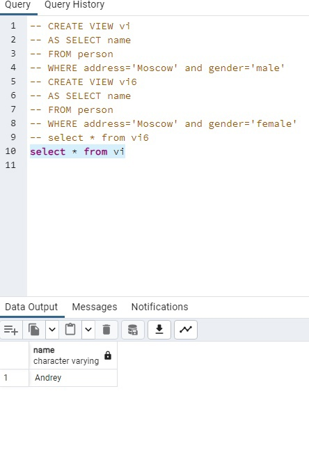
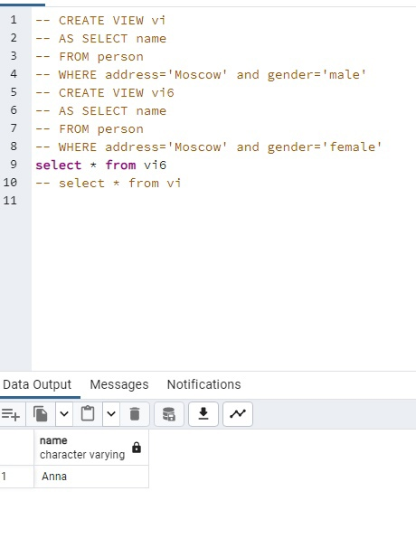
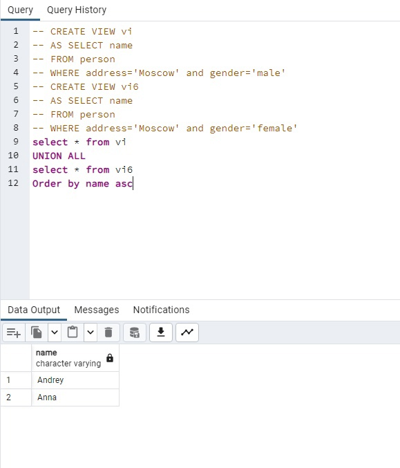
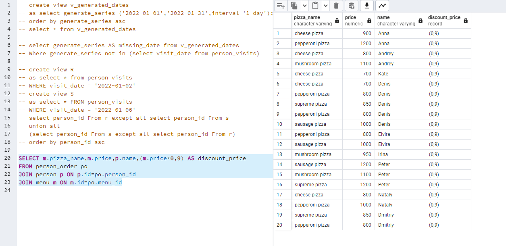

## 0




```
CREATE VIEW VI
AS SELECT name
FROM person
WHERE address='Moscow' AND gender='male'

CREATE VIEW V6
AS SELECT name
FROM person
WHERE address='Moscow' AND gender='female'

SELECT * FROM vi
SELECT * FROM v6

```
## 1




```
CREATE VIEW VI
AS SELECT name
FROM person
WHERE address='Moscow' AND gender='male'

CREATE VIEW V6
AS SELECT name
FROM person
WHERE address='Moscow' AND gender='female'

SELECT * FROM vi
UNION ALL
SELECT * FROM v6
ORDER BY name asc

```
## 2


```
CREATE VIEW v_generated_dates
AS SELECT generate_series ('2022-01-01','2022-01-31',interval '1 day')::date
ORDER BY generate_series asc
SELECT * FROM v_generated_dates

```
## 3


```
SELECT generate_series AS missing_date from v_generated_dates
WHERE generate_series NOT IN (SELECT visit_date FROM person_visits)

```
## 4


```
CREATE VIEW R
AS SELECT * FROM person_visits
WHERE visit_date = '2022-01-02'
CREATE VIEW S
AS SELECT * FROM person_visits
WHERE visit_date = '2022-01-06'
SELECT person_id From r EXCEPT ALL SELECT person_id FROM s
UNION ALL
(SELECT person_id From s EXCEPT ALL SELECT person_id FROM r)
ORDER BY person_id ASC

```
## 5




```
SELECT m.pizza_name,m.price,p.name,(m.price*0,9) AS discount_price 
FROM person_order po
JOIN person p ON p.id=po.person_id
JOIN menu m ON m.id=po.menu_id

```
