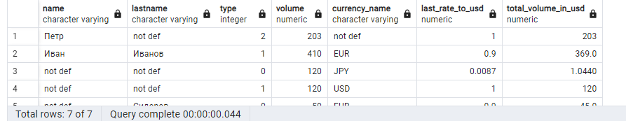

## 0


```
WITH max_update AS (
SELECT * FROM (SELECT id,name,updated,rate_to_usd AS last_rate_to_usd,ROW_NUMBER() OVER(PARTITION BY id ORDER BY updated DESC) AS "row_count"
FROM currency) AS "tmp"
WHERE "row_count" = 1)
SELECT
COALESCE(u.name, 'not def') AS "name",
COALESCE(u.lastname, 'not def') AS "lastname",
b.type,
SUM(b.money) AS "volume",
COALESCE(m.name, 'not def') AS "currency_name",
COALESCE(m.last_rate_to_usd, 1) AS "last_rate_to_usd",
(SUM(b.money) * COALESCE(m.last_rate_to_usd, 1)) AS "total_volume_in_usd"
FROM
balance b
LEFT JOIN
"users" u ON u.id = b.user_id
LEFT JOIN
max_update m ON m.id = b.currency_id
GROUP BY 1, 2, 3, 5, 6, m.last_rate_to_usd
ORDER BY 1 DESC, 2 ASC, 3 ASC

```
## 1

```


```
