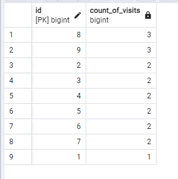
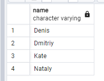
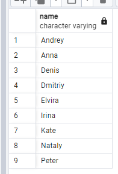

*17*
## 0

```
CREATE TABLE person_discounts (
id bigint primary key,
person_id bigint,
pizzeria_id bigint,
discount numeric,
constraint fk_person_discounts_person_id foreign key(person_id) references person(id),
constraint fk_person_discounts_pizzeria_id foreign key(pizzeria_id) references pizzeria(id)
);
## 1


```
CREATE TABLE person_discounts(
 id bigint primary key ,
 person_id bigint not null ,
 pizzeria_id bigint not null ,
 value Float not null,
 constraint fk_discount_person_id foreign key  (person_id) references person(id),
 constraint fk_discount_pizzeria_id foreign key  (pizzeria_id) references pizzeria(id)
)
ALTER TABLE discount AND CONSTANTION ch_nn_person_id CLECK (person_id IS NOT NULL)

## 2
## 3
## 4
## 5
## 6

```
CREATE SEQUENCE seq_person_discounts
MINVALUE 1 START WITH 1 INCREMENT BY 1;
ALTER TABLE person_discounts ALTER COLUMN id SET DEFAULT NEXTVAL('seq_person_discounts');


##24


## 0



```
SELECT person.id, (SELECT COUNT(person_visits.id) FROM person_visits WHERE person_visits.person_id = person.id) 
AS "count_of_visits" FROM person 
ORDER BY count_of_visits DESC, person.id ASC

## 1



```
WITH tlt AS (
SELECT person.name, (SELECT COUNT(person_visits.id) FROM person_visits 
WHERE person_visits.person_id = person.id) 
AS "count_of_visits" FROM person
ORDER BY count_of_visits DESC 
LIMIT 4
)
SELECT name FROM tlt ORDER BY name

## 2

## 3

## 4

## 5



```
SELECT DISTINCT person.name FROM person
LEFT JOIN person_visits ON person_visits.person_id = person.id
ORDER BY person.name

## 6

## 7


```
SELECT ROUND(AVG(pizzeria.rating), 4) AS "global_rating" FROM pizzeria

## 8
## 9
