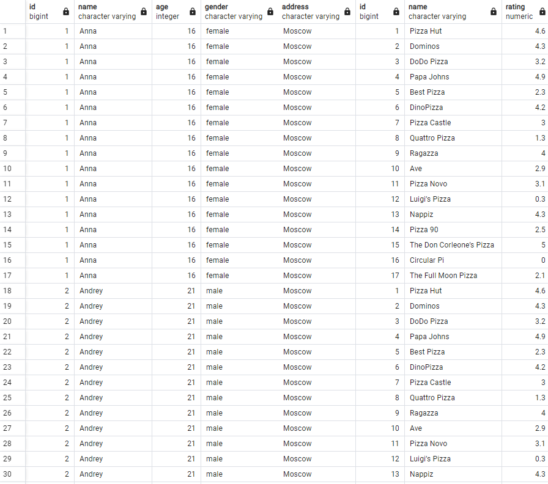
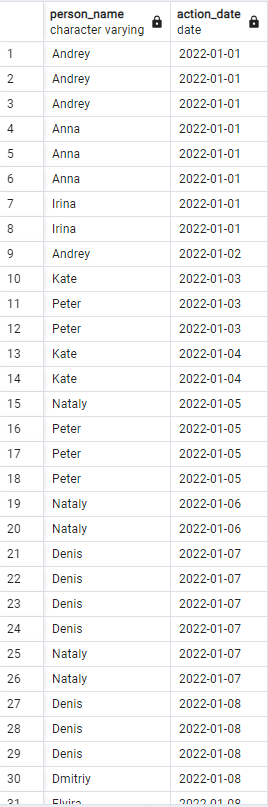
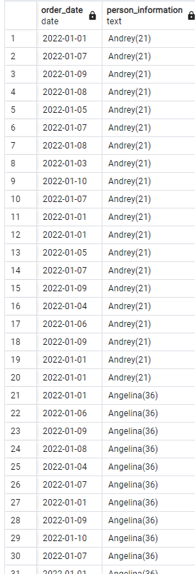
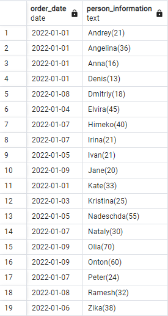

## 1



```
SELECT * FROM person, pizzeria

```
## 2


```
SELECT person.name AS person_name, order_date AS action_date FROM person_order JOIN person ON person_order.person_id = person.id
UNION ALL
SELECT person.name, visit_date AS action_date FROM person_visits JOIN person ON person_visits.person_id = person.id
ORDER BY action_date , person_name ASC

```

## 3


```
SELECT person_order.order_date, CONCAT(person.name,'(',person.age,')') AS person_information FROM person, person_order
ORDER BY person_information ASC
```
## 4


```
SELECT person_order.order_date ,CONCAT(person.name,'(',person.age,')') AS person_information FROM person_order
NATURAL JOIN person
ORDER BY person_information ASC
```
