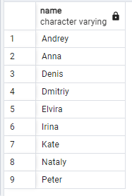

## 0


```
WITH tmp AS (
SELECT p.name, (SELECT COUNT(pv.id) FROM person_visits pv WHERE pv.person_id = p.id) AS "count_of_visits" FROM person p
ORDER BY count_of_visits DESC LIMIT 4
)
SELECT name FROM tmp ORDER BY name

```
## 4


```
WITH tmp_shit AS (
	SELECT p.id, COUNT(pv.id) AS "count_of_visits" FROM person p
	JOIN person_visits pv ON pv.person_id = p.id GROUP BY p.id
)
SELECT p.name, t.count_of_visits FROM person p
JOIN tmp_shit t ON t.id = p.id
WHERE t.count_of_visits > 3 GROUP BY p.name, t.count_of_visits

```
## 5


```
SELECT DISTINCT p.name FROM person p
LEFT JOIN person_visits pv ON pv.person_id = p.id
ORDER BY p.name

```
## 7


```
SELECT ROUND(AVG(p.rating), 4) AS "global_rating" FROM pizzeria p
```
