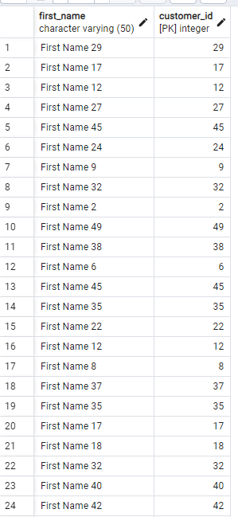
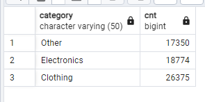

## 1


```
SELECT tk.first_name,tk.customer_id FROM customers tk
JOIN orders uo ON tk.customer_id = uo.customer_id
GROUP BY tk.customer_id,uo.order_date
HAVING COUNT (tk.customer_id) > 2 AND uo.order_date BETWEEN '2023-07-18' and '2023-10-18'

```
## 2


```
SELECT category , count(*) AS cnt
FROM products WHERE NOT price='50'
GROUP BY category

```

## 3

