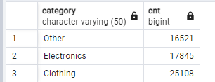
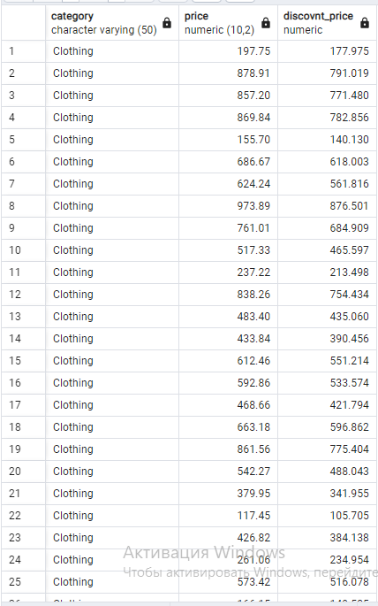

## 1


```
SELECT tk.first_name,tk.customer_id FROM customers tk
JOIN orders uo ON tk.customer_id = uo.customer_id
GROUP BY tk.customer_id,uo.order_date
HAVING COUNT (tk.customer_id) > 2 AND uo.order_date BETWEEN '2023-07-18' and '2023-10-18'

```
## 2


```
SELECT category , count(*) AS cnt
FROM products WHERE NOT price<='50'
GROUP BY category

```
## 4


```
SELECT c.first_name, c.last_name, c.email FROM customers c
JOIN orders o ON o.customer_id = c.customer_id
JOIN products p ON p.product_id = o.product_id
WHERE p.price > 1000 AND not p.category = 'Electronics';

```
## 6


```
 WITH tab AS(
 	SELECT customer_id,
	MAX(order_date) AS max_date,
	MIN(order_date) AS min_date From orders
	GROUP BY customer_id
 	),
tab1 AS (
	SELECT customer_id,max_date - min_date AS difference FROM tab
)
select customer_id from tab1 WHERE difference = (SELECT MAX(difference)FROM tab1)

```

## 8


```
SELECT category, p.price,(p.price * 0.9) AS discovnt_price FROM products p
WHERE category ='Clothing'

```
## 9


```
SELECT category, AVG(price) AS average_price
FROM products
GROUP BY category
ORDER BY average_price ASC;

```


