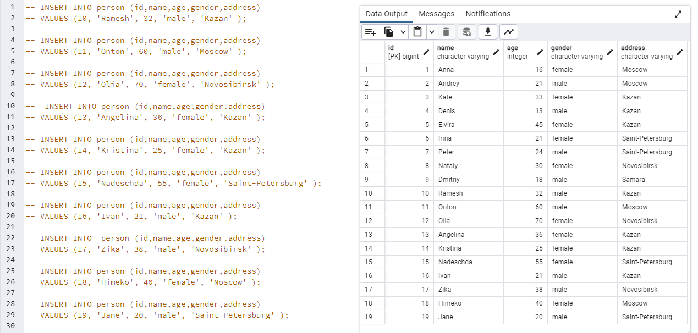
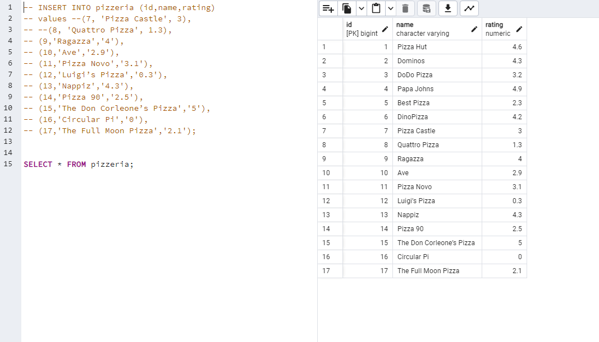
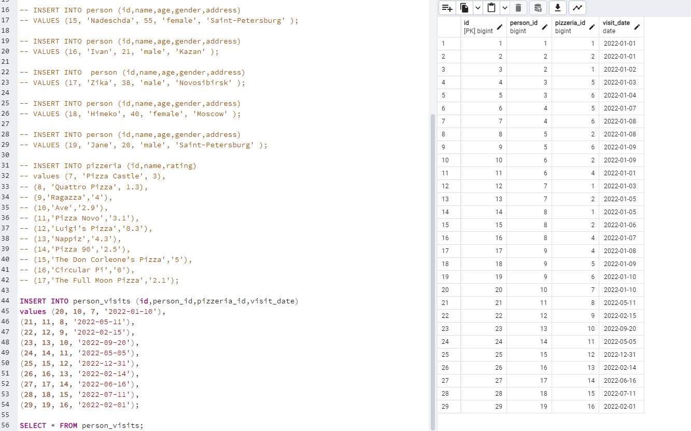
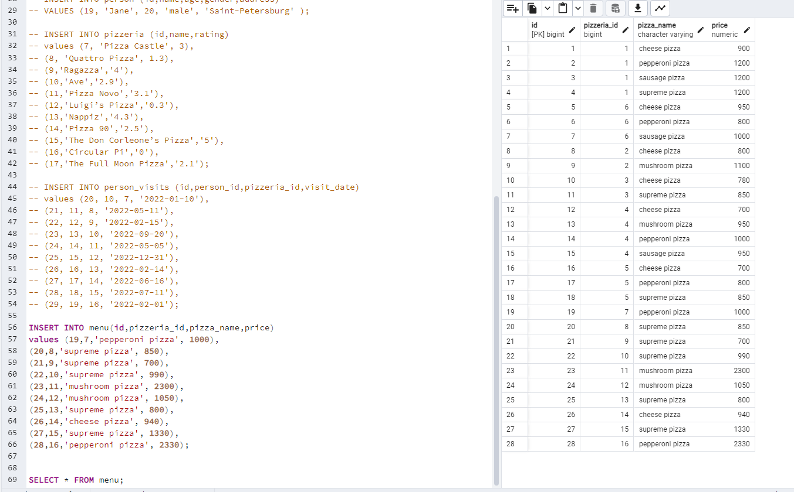
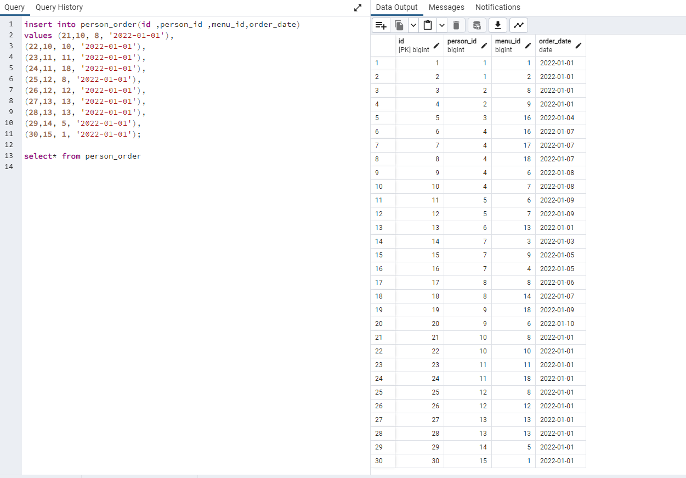
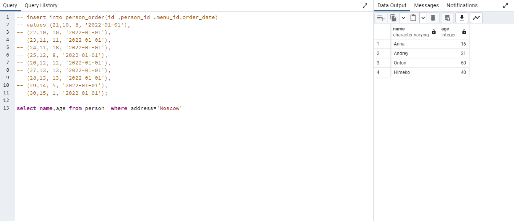
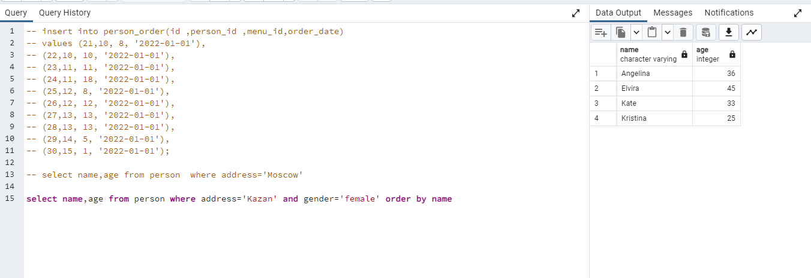
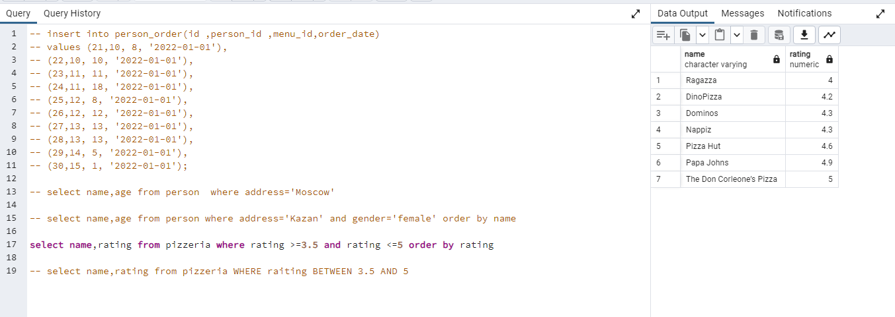
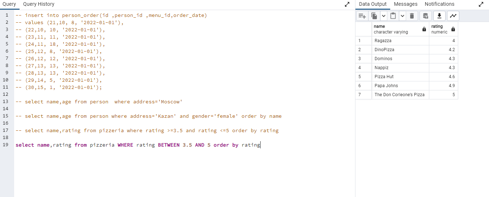
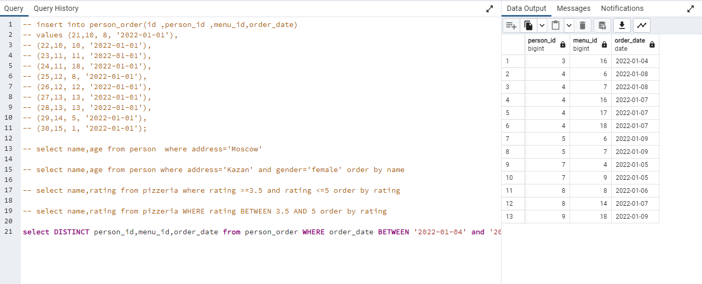

## Вставка по 10 записей в каджую таблицу\



```
SELECT * FROM table
```

\


\
## Запрос имен и возврастов пользователей из какого-то города



## Создайте оператор select, который возвращает имена и возраст всех женщин из списка.город '[любой]. Да, и отсортируйте результат по имени.



## Сделайте 2 синтаксически разных оператора выбора, которые возвращают список пиццерий.(название и рейтинг пиццерии) с рейтингом от 3,5 до 5 баллов (в том числелимитные баллы) и упорядочены по рейтингу пиццерий





## Создайте оператор select, который возвращает идентификаторы человека (бездублирование), посетивших пиццерии за период с [любая дата периода](включая все дни) или посещенную пиццерию с идентификатором 2. Также укажите заказпредложение по идентификатору человека в нисходящем режиме.


